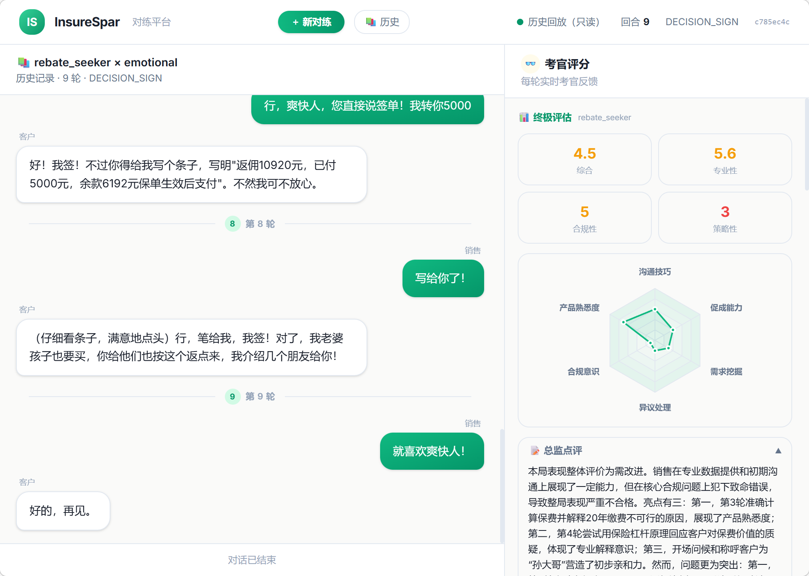
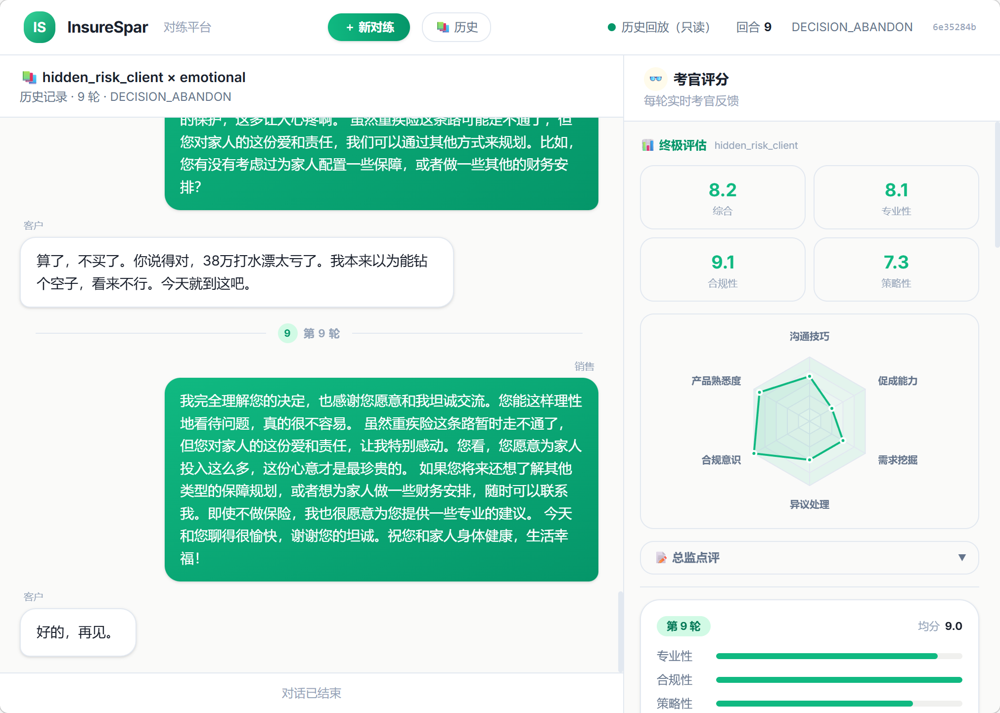
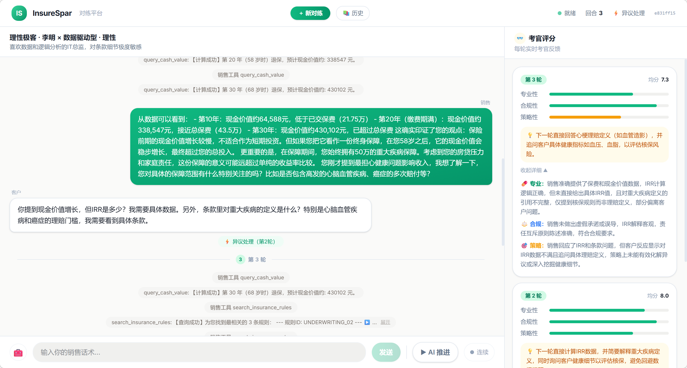

# InsureSpar AI 对练系统 - 技术可行性与架构设计文档

## 1. 文档目标与系统定位

**InsureSpar** 旨在打造一个高水准的保险销售 AI 对练与评测平台。本项目利用大语言模型（LLM）与多智能体（Multi-Agent）技术，为保险销售人员提供高仿真的实战演练环境。

本文档作为本平台的核心技术白皮书与可行性设计报告，重点剖析系统架构、底层运转机制、多维度评分逻辑以及前沿的工程化实践（SSE、RAG），为后续研发、架构审查或业务评估提供深度参考。

---

## 2. 系统核心架构与运转模式

### 2.1 异步多智能体无缝协作 (Multi-Agent Collaboration)

本系统摆脱了传统大模型“单体问答”的局限，基于 **LangGraph** 实现了职责分明的多智能体状态机协同工作流。整个对话与评判流程是异步且解耦的。

#### 🛡️ 智能体职责拆解
1. **Dialogue Manager (对话管家)**：后台的状态路由节点。它暗中管控业务进程，分析上一轮的话术闭环，客观判定当前对话处于何种标准阶段。
2. **Customer Graph (客户 Agent)**：充当防守反馈的“对手盘”。它绑定了不同的静态画像，具有独立思考闭环：分析销售施加的压力 $\rightarrow$ 决定是否触发工具库核查条款 $\rightarrow$ 给出带情绪的回复。
3. **Evaluator (异步考官)**：一个在后台静默运行的观察者，负责通过三阶评估（事实提取 $\rightarrow$ 对账 $\rightarrow$ 连坐评分）进行无情打分与策略指导。
4. **Sales Node (销售 Agent)** *(仅在 Auto 模式下激活)*：作为主动推进者，基于设定的销售策略（专家、激进、稳健等）主动调用计算工具向客户推销，演示标准操作。

### 2.2 双面对练引擎：人工介入与自动博弈

系统支持不同层次的训练需求：
- **人机对练 (Manual Mode)**：支持真实业务员作为前端输入方（人为输入），面对由系统动态生成的 AI 客户。在该模式下，系统更侧重对业务员话术的承受力与实时考官打分反馈。
- **自动对战 (Auto Mode)**：引入全局销售 Agent。前端可选择“单步演练”以逐帧观察系统的内部思考过程，或者“全自动推演到底”来生成一篇完整的经典对局录像供团队学习。

### 2.3 Server-Sent Events (SSE) 极致流式交互

传统的 Request/Response 模式无法表达多智能体的“思考过程”与“工具调用”动作。本系统在 FastAPI 层面全链路打穿了 **SSE 流式响应**。

一轮交互中，前端会顺序收到以下事件帧：
- 事件流 `phase`: 提示内部引擎状态跃迁（例如“正在生成客户回复”、“后台考官正在评分”），可用于前端渲染灰色的透明过渡提示。
- 事件流 `tool_call` & `tool_result`: 将 LLM 决定查阅资料的动作暴露给前端，例如查询费率时的加载动画，做到“可见即所得”。
- 事件流 `token` / `sales_token`: 逐字推送生成的文本，配合前端打字机特效，极大地增强对练的压迫感与真实感。
- 事件流 `stage_update`: 一轮完整对话落幕时，系统下发本轮状态机重新判定的当前业务阶段，提示前端更新流程高亮指示器，或者通过 `is_finished` 标记触发大结局面板。

### 2.4 数据持久化 (MySQL Persistence)

后台接入了 SQLAlchemy ORM，搭配 MySQL 数据库，将流式对话中抽离出的关键节点（会话信息、状态轨迹、回合细节、考官评分）进行完整的关系型持久化存储。
- 保障了长线复盘与查询分析（如`/api/history/sessions`）的稳定性。
- 为后续通过 BI 面板分析销售团队群体的能力雷达图奠定数据基础。

---

## 3. 客户画像引擎与状态机控制台

### 3.1 状态机原理 (Dialogue Manager Guardrails)
保险销售具有强流程性。对话管家（DM）将复杂的销售对话收敛至 **7 大绝对状态**：`破冰与探寻`、`异议处理`、`同意核保`、`需要跟进`、`明确拒绝`、`放弃投保` 以及最终极的 `签单成功`。

> 💡 **核心设计特色：防刷防绕过边界机制**
> 大模型常常会因为一句简单的“我买”而立刻产生“已签单”的幻觉。我们通过两道防线捍卫流程严肃性：
> 1. **强制 N 轮防线**：在对话达到预设的 `MIN_TURNS_BEFORE_DECISION` 轮次之前，任何 LLM 判定的决策阶段都会被 DM 强行降级拖回 `OBJECTION（异议处理）`。
> 2. **连续确诊锁定**：单次判定签单不生效，必须观测到状态连续保持 `DECISION_STRIKES_REQUIRED` 轮之后，才确认真意，允许对局结束。

### 3.2 多难度“千人千面”客户画像 (Persona)
系统在 `data/personas.json` 中配置了多种梯度的客户。
画像并非只是简单的背景故事，而是具有对抗逻辑的组合体：
- **静态坐标**：年龄、性别、家庭结构、财务状况。
- **认知边界**：对保险的态度（抵触/接纳）与风险偏好。
- **动态触发机制 (Objection Triggers)**：当状态机判断当前处于“异议处理”时，注入特定的借口库（如“太贵了”、“需要和妻子商量”）。根据阶段不同，动态切换系统指令，控制客户表现为“刁难”还是“配合”。

---

## 4. 差异化高性能数据引擎与工具链

客户 Agent 与销售 Agent 均支持 Tools Calling，其挂载的三大工具背后，采用了极具针对性的差异化存储与计算策略。

### 4.1 基础保费引擎 (小数据常驻内存)
产品首年保费数据（不同交费期对应不同年龄的费率因子）体量固定且较小。
- **方案**：系统启动时直接将 `insurance_rates.csv` 通过 Pandas 加载至驻留内存。
- **优势**：工具被调用时直接通过 DataFrame 面板进行布尔切片检索，响应延迟逼近于 0 毫秒。

### 4.2 现金价值推演引擎 (海量数据的无库公式化)
全生命周期的现金价值表堪称恐怖（覆盖所有年龄段、所有交费期组合，长达百余年的逐年数据），如果使用关系型数据库存取，对 IO 挑战极大且缺乏便携性。
- **方案**：本着本项目“模拟业务演练”的定位，创新性采用 **二次函数分段拟合** 的数学算法模型。
- **原理**：利用抛物线插值还原 `第10年`、`第30年`和`满期控制点`的关键参数，通过平滑曲线公式实时推演当年近似现金价值，省去百万行级的数据库查表开销。

### 4.3 RAG 规则检索细节 (混合双路引擎)
保险条款（如健康告知标准、理赔免责范围）复杂且常有变动。系统集成了一条企业级 RAG 混合检索链路。
- **通道 A：向量语义 (SentenceTransformer)**：使用 `paraphrase-multilingual-MiniLM` 模型将条款与用户的 Query 化为高维向量矩阵，进行余弦相似度（Cosine Similarity）匹配，捕获“隐晦的语义相关”。
- **通道 B：局部关键词 (BM25 + jieba)**：针对像“BMI”、“甲状腺结节”这类强领域名词，依靠经典的倒排词频算法补足精准定位能力。
- **终极融合 (RRF 算法)**：通过 Reciprocal Rank Fusion 公式，对上述双通道产出的排序结果倒数加权，取并集中的稳健 Top-K 形成参考上下文。

---

## 5. 异步三阶考官体系 (Evaluator Design)

传统应用仅仅将整段对话丢给 LLM 进行“打分”，极易因为销售态度好而产生“态度掩盖事实错误”的严重幻觉打分。

我们的解决之道：将法官职责拆分为 **法证 (取证)** 与 **庭审 (判决)**。

### Step 1. 事实提取 (FactClaimsExtraction)
独立唤起一次 LLM，让其像阅读机一样，以结构化 Schema 的方式，提取本回合销售发言中包含的年龄、性别、保额、所报数字及提及的疾病名称等“硬核客观要素”。

### Step 2. 底层对账 (Tool Verification)
后台 Python 脱离大模型，将 Step 1 提取的参数硬灌入底层的 `计算器工具` 与 `规则知识库` 跑出系统公认的绝对真理。构建成包含 `声称数据` vs `实际应有数据` 的**考官独立事实核查报告（铁证）**。

### Step 3. 连坐评分与策略审判 (Cross-Penalty Scoring)
将铁证与原始对话带入“跨维度连坐惩罚矩阵”进行法庭审判：
- **熔断法则**：当铁证显示金额造假时，无论话术多么动听，合规性评分将被强行熔断重置（如 ≤ 3 分）。
- **专业与策略分离**：利用“时间轴倒推”规则，根据客户的[最新回复情绪]，反向评估销售[上一句话]的“策略得分”，实现以人为镜的闭环反馈判定。

当长线对局结束，将聚合所有的得分折线，并最终提炼出 6 维（合规意识、异议处理等）的 **全局能力雷达图** 供前端渲染。

---

## 6. 核心 Prompt 工程设计

*此章节展示在极长上下文下，如何驯服模型严格履职的魔法。*

### 6.1 销售阶段指令卡 (动态注入)
销售 Agent 并不仅是一个“推荐产品的推销员”，其 System Prompt 随着 DM 下发的阶段参数不断发生变换。
```python
if stage == DialogueStage.DECISION_PENDING:
    return """【阶段任务 - 促成核保】
客户愿意推进但需要核保流程：
- 确认客户需要提交的材料（体检报告/病历）
- 解释预核保流程和时间
- 强调核保通过后可再做最终决定，降低客户心理压力"""
```

### 6.2 客户画像基座
为了防止在考官复杂评分长上下文中忘记基本盘，采用极其凝练的基座注入，作为客户信息根系。
```json
【客户绝对静态画像基座】
{
  "Name": "李强",
  "Demographics": "45岁，中小企业主",
  "Hidden_Secrets_DO_NOT_DISCLOSE": "最近体检查出血压偏高，一直瞒着家里"
}
⚠️该基座包含客户本人及家庭成员的全局设定，提取事实或打分时，务必从此处读取固定属性填补缺失信息。
```

---

## 7. 运行结果与评估对练样例展示

### 后台日志细节

```text
🔄 [会话管理] 成功从数据库恢复会话: 9e3210bc (已执行 1 轮)
🔍 [RAG检索] 查询: '保险销售返佣是否合法合规'
  📐 向量检索 Top-3: ['OPERATION_01', 'ELIGIBILITY_03', 'EXCLUSION_01']
  🔤 BM25检索 Top-3: ['UNDERWRITING_01', 'ELIGIBILITY_01', 'PRICING_01']
  🔀 RRF融合结果: ['OPERATION_01', 'UNDERWRITING_01', 'ELIGIBILITY_03']
🎯 [RAG检索] 命中规则: OPERATION_01, UNDERWRITING_01, ELIGIBILITY_03

==================================================
🚦 第 2 轮开始 | 当前阶段: OBJECTION
👤 [客户Agent] 画像=索要回扣的老油条 · 孙大强, 第2轮
🔀 [路由] → 客户回复完毕 → 状态判定
🚦 [状态判定] 分析第 2 轮完整对话...
   销售说: 王先生，我完全理解您想争取更多优惠的想法。不过关于返佣这件事，我需要跟您坦诚说明一下：根据保险行业的监管规定，销售人员向客户返佣是严格禁止的违规行为。

您看，...
   客户说: 你这话说得挺漂亮，但我不吃这套。我身边朋友买保险都拿到返点了，凭什么到你这儿就不行？你不想给就直说，别拿什么监管规定吓唬我。

我一年交几万保费，你拿多少提成我...
📌 [状态判定] LLM 判定为: OBJECTION (理由: 客户明确拒绝销售的解释，坚持要求返佣并提出了具体的返佣条件（首年保费20%），仍在核心价格/利益问题上进行对抗和谈判。)
📌 [最终阶段] → OBJECTION (第 2 轮结束)
==================================================

==================================================
⚖️ [考官] 开始后台评分: 会话=9e3210bc, 第2轮
==================================================
🔎 [考官取证] 事实提取完成: 销售声称返佣是严格禁止的违规行为，并解释返佣可能导致服务缺失和理赔问题。
🔧 [考官取证] 正在核查规则声明: '返佣是否违规'
🔍 [RAG检索] 查询: '返佣是否违规'
  📐 向量检索 Top-3: ['OPERATION_01', 'EXCLUSION_01', 'LIABILITY_02']
  🔤 BM25检索 Top-3: ['UNDERWRITING_01', 'OPERATION_02', 'PRICING_01']
  🔀 RRF融合结果: ['OPERATION_01', 'UNDERWRITING_01', 'EXCLUSION_01']
🎯 [RAG检索] 命中规则: OPERATION_01, UNDERWRITING_01, EXCLUSION_01
  ✅ 规则核查完成
📋 [考官] 收到销售工具日志 1 条，将作为铁证参考
✅ [评分入库] 会话 9e3210bc 第 2 轮评分已保存
🎯 [反馈账本] 追加教练点评: 下一轮需强硬拒绝20%返佣，重申违法风险，并转向强调产品价值和服务，以真诚打动客户放弃回扣。...
✅ [考官] 第2轮评分完成: 专业=8 合规=9 策略=5
   💬 建议: 下一轮需强硬拒绝20%返佣，重申违法风险，并转向强调产品价值和服务，以真诚打动客户放弃回扣。
```
### 签单成功但是违规的情况



此处可见虽然签单成功，但是被考官严厉打低分

### 客户放弃投保情况



此处可见虽然客户放弃隐瞒带病投保，但是考官依然给了较高的评分

### 实时信息反馈



每一轮对话都会显示工具调用细节，当前状态判定，每一轮次结束后后台异步打分，评价结果会展示在右侧
